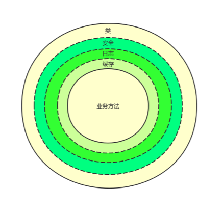

## 术语
  ### IoC
    控制反转（Inversion of Control，缩写为IoC），是面向对象编程中的一种设计原则，可以用来减低计算机代码之间的耦合度。
    其中最常见的方式叫做依赖注入（Dependency Injection，简称DI），
    还有一种方式叫“依赖查找”（Dependency Lookup）。通过控制反转，对象在被创建的时候，由一个调控系统内所有对象的外界实体，将其所依赖的对象的引用传递给它。也可以说，依赖被注入到对象中。
  ### AOP
    AOP为Aspect Oriented Programming的缩写，意为：面向切面编程，通过预编译方式和运行期动态代理实现程序功能的统一维护的一种技术。
## 设计原则
    提供IoC容器，通过配置仅加载核心模块(安全模式), 并控制其类的生命周期，并对类的调用进行日志和性能监控。主要为包装AutoFac，提供通用配置。
    支持构造函数、属性注入、泛型注入、注入选择。
## 设计原理
    主要通过Castle组件，对业务代码封装，实现动态类。如图：
  

### 说明
  LifeStyle：
        标识类的生命周期
*	Singleton:
标识一个类的生命周期为单例的。
*	Transilent:
标识一个类的生命周期为短暂的。
*	InstancePerRequest:
标识一个类的生命周期为在一个请求为同一个。

ModuleLevel：
        标识类的级别
*	Core:
核心模块。
*	Normal
普通模块（默认）。
*	Third
第三方模块。

Interceptor：
        标识类的需要的拦截器
*	Log:
表明会使用LoggerInterceptor进行拦截。
*	Measure
表明会使用MeasureInterceptor进行拦截。
*	Caching
表明会使用CachingInterceptor进行拦截。
*	ExceptionHandle
表明会使用ExceptionHandlingInterceptor进行拦截。
